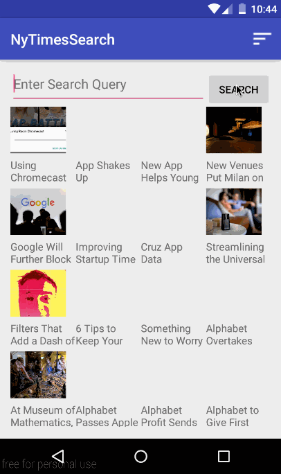

NYTimesSearch:
NYTimesSearch is an android client to search articles from NY Times

Submitted by: Samarth Narielwala

Time Spent: 6-8 hours spent in total

# User Stories

The following **required** functionalities have been completed:
1.User can enter a search query that will display a grid of news articles using the thumbnail and headline from the New York Times Search API. (3 points)
2.User can click on "settings" which allows selection of advanced search options to filter results. (3 points)
3.User can configure advanced search filters such as: (points included above)
Begin Date, News desk values (Arts, Fashion & Style, Sports)
4. Sort order (oldest or newest)
5. Subsequent searches will have any filters applied to the search results. (1 point)
6. User can tap on any article in results to view the contents in an embedded browser. (2 points)
7. User can scroll down "infinitely" to continue loading more news articles. The maximum number of articles is limited by the API search. (1 point)

The following **optional** features 

Robust error handling, check if internet is available, handle error cases, network failures
Used the Butterknife library
Leverage the popular GSON library to streamline the parsing of JSON data.

Here's a walkthrough of implemented user stories:

#Video Walkthrough

## License

Copyright [2015] [Samarth Narielwala]

Licensed under the Apache License, Version 2.0 (the "License");
you may not use this file except in compliance with the License.
You may obtain a copy of the License at

http://www.apache.org/licenses/LICENSE-2.0

Unless required by applicable law or agreed to in writing, software
distributed under the License is distributed on an "AS IS" BASIS,
WITHOUT WARRANTIES OR CONDITIONS OF ANY KIND, either express or implied.
See the License for the specific language governing permissions and
limitations under the License
